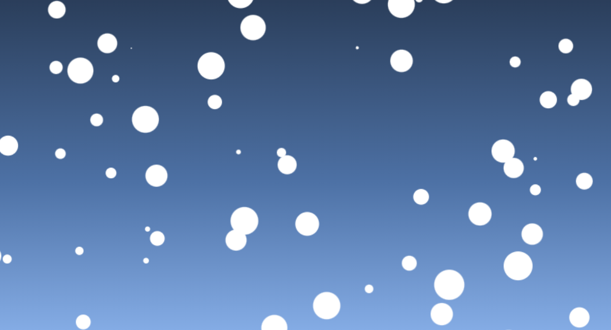

# Particle Animation

This is a simple particle animation using HTML5 Canvas and JavaScript. The particles move around the screen and bounce off the edges of the canvas, creating a dynamic visual effect.

## Demo



## Features

- Particles move randomly on the canvas.
- Particles bounce off the edges of the canvas.
- You can easily customize the number, size, and speed of the particles.

## Installation

1. Clone the repository or download the source code.

   ```bash
   git clone https://github.com/your-username/particle-animation.git
